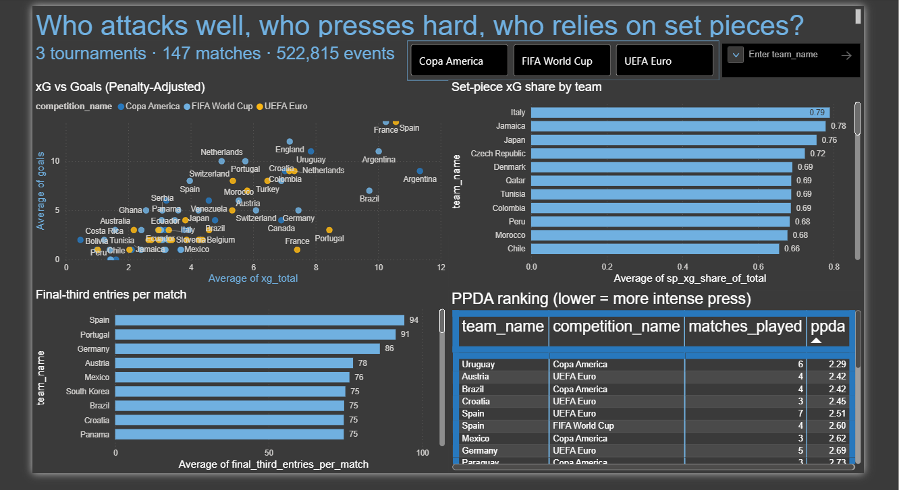
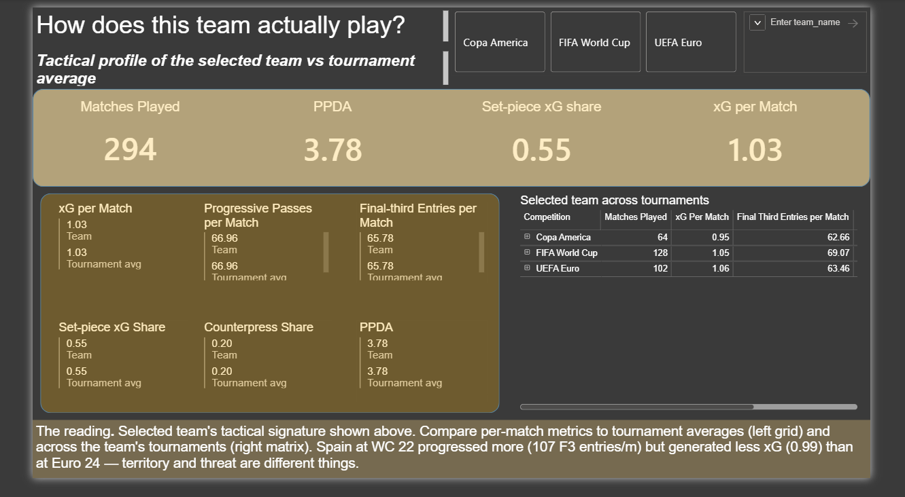
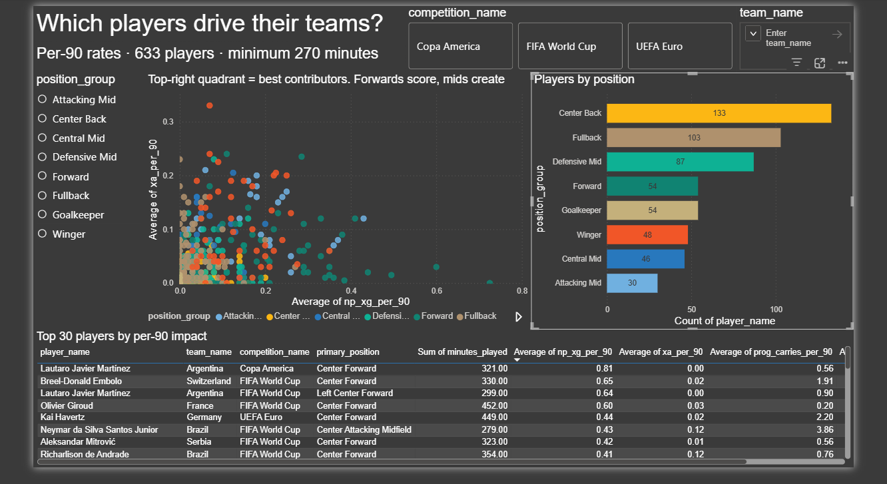
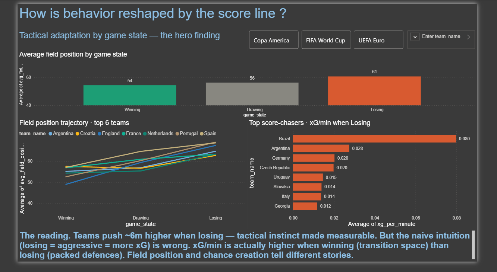
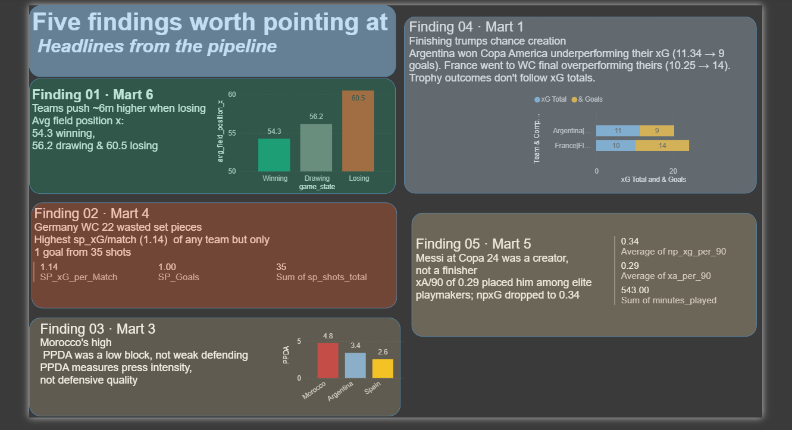

# StatsBomb football analytics pipeline

A Bronze, Silver, Gold pipeline on StatsBomb open event data. Six analytical marts answering specific football questions across three tournaments.

**Stack:** Python, DuckDB, dbt Core, Parquet, Power BI.
**Scope:** FIFA World Cup 2022, UEFA Euro 2024, Copa America 2024. 147 matches, 522,815 events.

---

## Headline findings

The whole point of this pipeline is to answer questions, so the answers come first.

1. **Teams push around 6 metres higher up the pitch when losing than when winning.** Average x coordinate goes from 54.3 (winning) to 56.2 (drawing) to 60.5 (losing). Score line actually changes where teams play.

2. **Germany at WC 2022 generated the most set-piece xG per match (1.14) but converted only 1 out of 35 shots.** Their group-stage exit was as much a finishing problem as a chance creation problem.

3. **Morocco's high PPDA at WC 2022 was not weak defending.** It was a deliberate low block. PPDA tells you about press intensity, not defensive quality. Two different things, often mixed up.

4. **Reaching the final third is not the same as creating chances there.** A few teams ranked high on final-third entries per match but low on shot conversion from those entries. Volume of progression doesn't always mean attacking output.

5. **Messi at Copa 2024 was a creator, not a finisher.** xA per 90 of 0.29 put him among the top playmakers. His non-penalty xG dropped to 0.34. Role shift visible in the numbers.

---

## Dashboard

A 5-page Power BI dashboard sitting on top of the pipeline. I export the marts to Parquet using `scripts/export_to_parquet.py` and load those Parquet files directly into Power BI. No ODBC connection, no live refresh. Snapshot data for a portfolio project.

The 5 pages:

1. **Tournament Overview.** The first page someone sees. Shows all 3 tournaments at once, no drilling. xG vs goals scatter, set-piece share leaderboard, final-third entries leaderboard, PPDA leaderboard.
2. **Team Profile.** Drilldown page. Pick a team in the slicer and the whole page updates. KPI row at top, 6 small comparison cards in the middle showing team vs tournament average, matrix on the right showing the team's metrics across each tournament they played in.
3. **Player Impact.** 633 players after the 270-minute filter. Scatter of npxG/90 vs xA/90 colored by position group, position breakdown bar chart, sortable top-30 player table.
4. **Game State Analysis.** The hero page. Average field position by game state (54.3 winning, 56.2 drawing, 60.5 losing). Line chart with the same effect per team, top score-chasers bar, insight callout.
5. **Key Findings.** Five recap rows stacked top to bottom. Text on the left, small chart on the right proving each finding.

Two slicers (tournament and team) are synced across all pages. Page 3 has a third slicer for player position that stays local to that page. Page 5 has no slicers because the findings are fixed and tied to specific teams.

`docs/dashboard_walkthrough.md` covers each page in detail with the design decisions behind it.







---

## What this project shows

A medallion architecture (Bronze, Silver, Gold) with the right tool at each layer. Schema-on-read with sparse Parquet files (handled with `union_by_name=true` after the first build crashed). dbt Core for ref-based lineage and a 36-test data-quality suite. Window functions in SQL to reconstruct match scores from events without scoreboard data. Interval-based time aggregation to guarantee a mathematical invariant. A custom dbt test that found a real bug in a finished model. Football reasoning baked into metric design: penalties excluded from xG totals, throw-ins included in set-piece chains, PPDA defined within zone constraints, per-90 normalisation gated by a 270-minute floor.

---

## Data sources

StatsBomb Open Data via the `statsbombpy` Python library. Three tournaments picked because they were structurally comparable:

- FIFA World Cup 2022 (Qatar), 64 matches
- UEFA Euro 2024 (Germany), 51 matches
- Copa America 2024 (USA), 32 matches

Total: 147 matches, 522,815 events, 7,449 player-match rosters.

One tournament was not enough data to answer cross-comparison questions. I skipped the Women's World Cup to keep the data consistent in style and pace, no other reason.

---

## Pipeline layers

### Bronze: raw partitioned Parquet

```
data/bronze/competition=FIFA_World_Cup_2022/season=2022/match_id=3869151/
    events.parquet
    lineups.parquet
    match_metadata.parquet
```

Hive partitioning lets DuckDB read folder names as filterable columns automatically. One folder per match means re-ingestion is safe and isolated. More small files than strictly needed at this scale, but a fair trade-off.

Coordinates were flattened in Bronze. The five `*_location` columns became x/y/z columns. Complex nested fields like `shot_freeze_frame`, `tactics`, `cards`, and `positions` stayed nested for later layers to handle in context.

`statsbombpy.lineups()` returns a dict of DataFrames keyed by team name, not a single DataFrame like all the other API calls. A `flatten_lineups` helper concatenates both teams with a `team_name` column.

Final Bronze: 443 files, no failures. A second run skipped all 147 matches in under a second. Idempotency confirmed.

### Silver: cleaned tables in DuckDB

Four staging models built with dbt:

| Model | Rows | What it does |
|-------|------|--------------|
| `stg_events` | 522,815 | Event grain. NaN booleans coalesced to `false`, nullable float IDs cast to `BIGINT`, string `'nan'` converted to real `NULL`, timestamps parsed. |
| `stg_matches` | 147 | One row per match. Manager nicknames cleaned, dates cast, referee IDs typed. |
| `stg_competitions` | 3 | Distinct competitions for label joining. |
| `stg_lineups` | 7,449 | One row per player per match. `cards` and `positions` left nested. |

Biggest call in Silver was keeping `stg_events` as one wide table instead of splitting by event type. Splitting forces unions everywhere downstream because Gold marts constantly join events to events (passes feeding shots, pressures triggering recoveries). One wide table is cheaper to query in a columnar store.

### Gold: business marts

Six marts. Each one answers a different football question. All built as `table` materialisation for fast Power BI reads.

| Mart | Grain | What it answers |
|------|-------|-----------------|
| `mart_team_attack_quality` | (team, comp, season) | xG, shot quality, shape of attack |
| `mart_team_ball_progression` | (team, comp, season) | Progressive passes and carries, final-third entries, possession-to-shot |
| `mart_team_defensive_pressure` | (team, comp, season) | Pressures, high-press share, counterpress share, PPDA, regain rate |
| `mart_team_set_piece_effectiveness` | (team, comp, season) | Full-chain set-piece xG, conversion, dependency share |
| `mart_player_impact` | (player, team, comp, season) | Per-90 rates: xG, xA, progressive carries, dribbles, pressures, recoveries |
| `mart_team_gamestate_behavior` | (team, match, game_state) | How teams adapt when winning, drawing, losing |

---

## Featured SQL: game-state reconstruction

The hardest single piece of SQL in the project.

StatsBomb stores only the final score per match. To answer "how does Spain attack when winning vs losing", I had to reconstruct the score from events. Goals are events with timestamps. Between two goals, the score is constant. So I sliced the match into intervals between goals, labelled each interval per team, then aggregated metrics within those intervals.

```sql
-- Interval-based duration logic that makes Mart 6 symmetric by construction.
match_length as (
    select
        match_id,
        max(abs_seconds)        as match_end_seconds,
        any_value(home_team)    as home_team,
        any_value(away_team)    as away_team
    from events_timed
    group by match_id
),
score_changes as (
    select
        g.match_id,
        g.goal_seconds,
        sum(case when g2.scoring_team = g.home_team then 1 else 0 end) as home_goals_after,
        sum(case when g2.scoring_team = g.away_team then 1 else 0 end) as away_goals_after
    from goals g
    join goals g2
        on g.match_id      = g2.match_id
       and g2.goal_seconds <= g.goal_seconds
    group by g.match_id, g.goal_seconds, g.home_team, g.away_team
)
-- segments_per_team unions home and away perspectives:
-- each match-segment yields two rows with opposite (Winning/Losing) labels.
```

The first version walked one team's event stream and computed durations between consecutive events of the same team. Asymmetric by design, because event density differs between teams. Fix moved duration accounting to match-clock intervals, which both teams share.

---

## Data quality and tests

`dbt test` runs 36 tests in 1.17 seconds.

```
- 26 not-null tests across staging and gold
- 3 unique-key tests on primary identifiers
- 2 accepted-values tests on enum columns
- 1 custom singular test: game_state_symmetry
```

### The custom test that found a real bug

`tests/game_state_symmetry.sql` checks an invariant that has to hold mathematically. For every match, the home team's "Winning" minutes must equal the away team's "Losing" minutes. Same time slice from two perspectives.

The first build of `mart_team_gamestate_behavior` failed this test on 122 of 125 matches. Average diff was 26 minutes, max was 65. So the bug was real, not just rounding noise. Root cause: durations were computed by walking each team's event stream, so the team with denser events got more total time attributed.

I rebuilt the duration logic to slice the match clock into score-segments at goal events. Both teams share the same partitioning. Only the state labels mirror. After the fix: 0 minutes diff, 125 of 125 matches symmetric.

This is the best example in the project of why programmatic invariants matter. The original output looked plausible. Eye test passed. Only the symmetry test caught the flaw.

---

## ML experiment: tournament outcome classifier

I tried a small classifier predicting how far a team gets in a tournament. Three classes: group-stage exit, knockout pre-final, finalist. 17 features from the 4 team-grain marts, 72 rows total.

It did not work.

| Model | CV Accuracy | Std Dev |
|---|---|---|
| Majority-class baseline | 0.472 | — |
| Logistic Regression | 0.511 | ±0.088 |
| Random Forest | 0.468 | ±0.169 |

Logistic Regression beat baseline by 0.039, but the standard deviation of 0.088 is wider than that gap. Statistically the model was no better than guessing. Random Forest was actually worse.

The reason is not the model. It is the data. 72 rows is small for ML, especially with 17 features. And the data has hard contradictions inside it. Germany at WC 22 had the highest xG per match (2.48) of any team in the dataset and got eliminated in groups. England at Euro 24 had xG per match of 0.83 and made the final. No classifier resolves that with this sample size.

Random Forest's feature importance was still interesting though. Set-piece conversion rate ranked first (0.148), ahead of xG per match in fourth (0.074). My read on this: aggregate xG numbers are noisy at small samples because finishing variance washes them out, while set-piece situations are more standardized so a team's set-piece coaching shows through more consistently.

I called this a feature exploration experiment in the writeup, not a working classifier. The model failing is the actual finding. Full version with the interview answer I rehearsed lives in `docs/ml_results.md`.

---

## How to run

```bash
# 1. Environment
conda env create -f environment.yml
conda activate football

# 2. Bronze ingestion
python src/ingestion/ingest_bronze.py

# 3. dbt build (Silver + Gold)
cd dbt/statsbomb_warehouse
dbt run

# 4. Run tests
dbt test

# 5. Export marts to Parquet for Power BI
cd ../..
python scripts/export_to_parquet.py

# 6. Open Power BI Desktop, load the .pbix file from visualization/
#    or load the 7 Parquet files from data/exports/ manually

# 7. Optional: run the ML experiment
python scripts/build_team_outcomes.py
python scripts/build_ml_dataset.py
python scripts/train_outcome_model.py
```

---

## Known limitations

Listing these honestly. Real engineering work has bounded accuracy. Hiding it is worse than owning it.

Player minutes are approximate. They come from `stg_lineups.positions` segments. When the `to` timestamp is null (player on the pitch at full time), I use a 120:00 fallback. Slightly over-counts minutes for late substitutes in stoppage time. Per-90 rates are within roughly 2-3% of true values for most players.

`primary_position` is the modal position from a player's events, not their fielded role. A right-back who took two corners from the left will still resolve to "Right Back" because of vote weight. Edge cases exist.

xG overperformance (Goals minus xG) is descriptive at this sample size, not predictive. At 3-7 matches per team, the regression-to-mean signal is poor. The metric is reported but should not be used to project anything forward.

PPDA uses an adapted definition. Classic Opta PPDA includes tackles, interceptions, and fouls. StatsBomb has no clean `Interception` event type, so I used pressures + duels of type `Tackle` + fouls. Same direction (lower means more intense press), different absolute numbers from Opta.

The 270-minute filter on `mart_player_impact` excludes players with limited tournament minutes. Per-90 stats below this threshold are not stable. Backup players with cameo brilliance get dropped. Trade-off was worth it.

`mart_team_gamestate_behavior` filters trivial state slivers (`minutes_in_state >= 3`). A team that was leading for 90 seconds before equalising does not show up in "Winning" rows. Three minutes is a judgement call. Two would also work.

Penalty shots are excluded from xG aggregations in Marts 1, 4, and 5. Penalty xG (around 0.76) reflects a standardised setup, not attacking skill.

Throw-ins are included in set-piece chains in Mart 4. Some teams use long throws as attacking weapons (Brentford, Liverpool under Klopp). Excluding them would understate that. Trade-off is more noise from routine throw-ins.

Bronze did not flatten the `location` column on every event. Only `*_end_location` columns were flattened. Downstream models index `location[1]` and `location[2]` for x/y. A future refactor would flatten this in Bronze for consistency.

---

## Future work

Eleven more business questions got scoped out and parked for v2: shot-creating actions, deep-block penetration, pressure-to-recovery chains, formation-adjusted metrics, opponent-strength-adjusted xG, and others. The list grew faster than I could build.

A possession-grain mart would expose questions that team-grain hides. Each possession has a story (where it started, where it ended, did it produce a shot). Right now I aggregate across possessions, which loses that story.

For the ML side, a v2 would either reduce to a 2-class problem (group-stage exit vs progressed) for an easier signal, or add more tournaments (WC 2018, AFCON 2023) to push the sample past 250 team-tournaments. Club-season data would be the most useful addition but it is also the most expensive. StatsBomb open data does not include comprehensive club coverage, so I would need either a paid API or to scrape FBref-style aggregations.

Streaming ingestion is overkill for static StatsBomb data, but rebuilding around event streams (Kafka into S3 into DuckDB) would mirror real production patterns. Worth doing for the practice even if the data does not need it.

Cloud deployment: ADLS or S3 for storage, dbt Cloud for orchestration, Power BI Service for hosting. Not done here because everything sits on my laptop right now, but the move is straightforward when I want to put it somewhere others can see it without my machine being on.

---

## Project layout

```
statsbomb-de-project/
├── data/
│   └── bronze/                     # Hive-partitioned Parquet (gitignored)
├── dbt/
│   └── statsbomb_warehouse/
│       ├── models/
│       │   ├── staging/            # 4 Silver models + schema.yml
│       │   └── gold/               # 6 Gold marts + schema.yml
│       ├── tests/                  # game_state_symmetry.sql (custom)
│       └── dbt_project.yml
├── docs/
│   ├── project_notes.md
│   ├── dashboard_walkthrough.md
│   └── ml_results.md
├── scripts/
│   ├── export_to_parquet.py
│   ├── inspect_bronze.py
│   ├── inspect_bronze_meta.py
│   ├── query_warehouse.py
│   ├── validate_mart_1.py to _6.py
│   ├── build_team_outcomes.py
│   ├── build_ml_dataset.py
│   └── train_outcome_model.py
├── src/
│   └── ingestion/
├── visualization/
│   ├── statsbomb.pbix
│   └── screenshots/
├── warehouse/                      # gitignored
├── README.md
└── .gitignore
```

---

## Contact

Built by [Sai Deepak Lingam](https://github.com/saideepaklingam) 